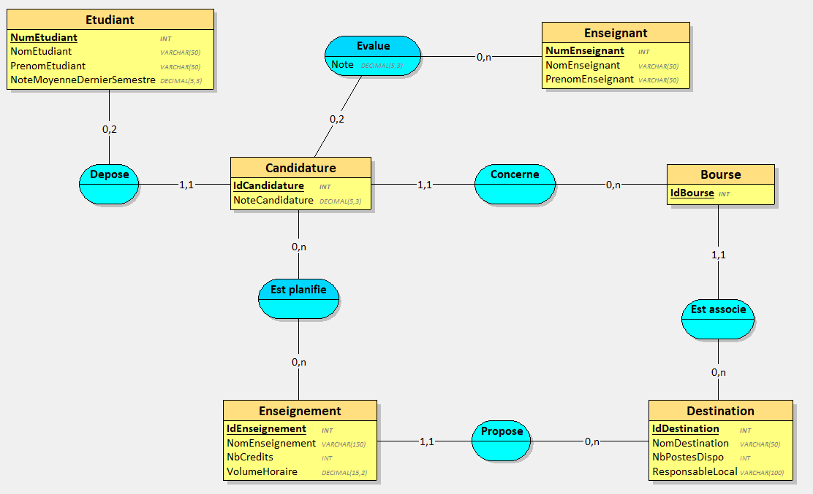
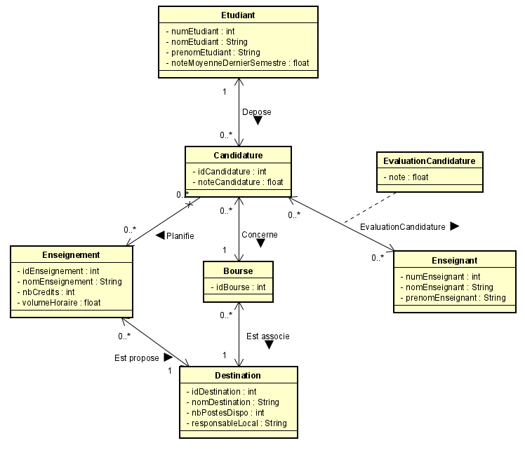
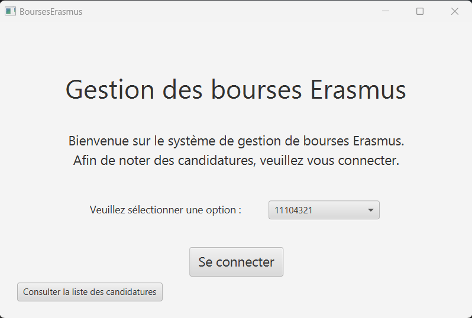
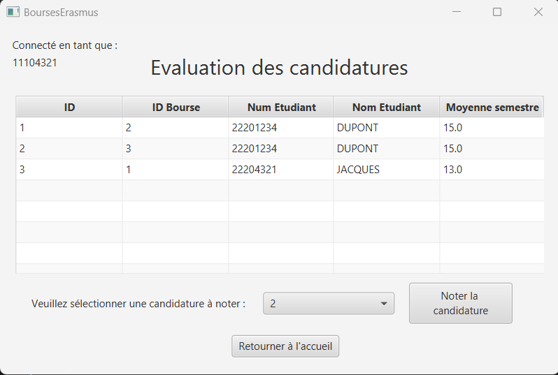
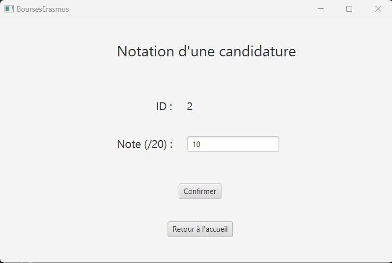
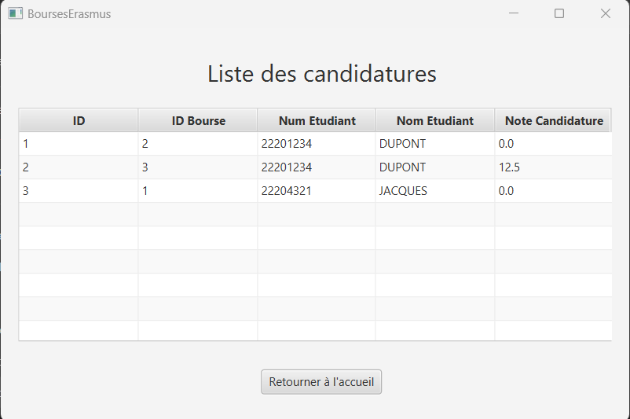

# BoursesErasmus

## Présentation

Projet de programmation d'une application liée à une base de données permettant de gérer des bourses Erasmus. Projet réalisé dans le cadre du module "Lien SGBD - Langage OO" du septième semestre du cycle ingénieur de Polytech Tours.

Cette application a été développée en Java en faisant appel à JDBC pour se connecter à une base données MySQL et à JavaFX pour les interfaces graphiques.

### Contenu

Cette application permet à des enseignants de noter des candidatures à des bourses. Un enseignant souhaitant noter une candidature d'un étudiant pour une bourse va pouvoir se connecter puis sélectionner la candidature à noter et enfin attribuer une note. Une fois une candidature notée par deux enseignants différents, une note est calculée pour celle-ci.

## Conception

### Schéma de la base de données

### Diagramme de classes

## Manuel de l'utilisateur

### Outils nécessaires

- Eclipse IDE
- MySQL Community Server 8.1, installé en version complète et configuré avec MySQL Configurator en indiquant "root" en mot de passe root
- MySQL Workbench 8

### Installation

1. Ouvrir MySQL Workbench et créer une nouvelle connexion (nommée "tp" par exemple)
2. Aller dans la connexion créée et ajouter une nouvelle base de données nommée "bourseserasmus"
3. Ouvrir le projet dans eclipse et lancer Main.java
4. La base de données est automatiquement remplie au lancement du programme et la fenêtre du programme s'ouvre. (Il est possible de consulter le contenu de la base de données dans MySQL Workbench)

### Utilisation

1. Dans la fenêtre d'accueil, sélectionner le numéro de l'enseignant qui doit noter une candidature et cliquer sur le bouton de connexion
2. Dans la fenêtre d'évaluation des candidatures, sélectionner le numéro de la candidature à noter et cliquer sur le bouton
3. Dans la fenêtre de notation de la candidature, indiquer la note à attribuer et confirmer
4. De retour sur la page d'accueil il est maintenant possible de consulter la liste des candidatures ainsi que leurs notes associées (note disponible une fois que la candidature a été notée par deux enseignants différents). Il est aussi possible de continuer à évaluer des candidatures

## Images de l'application

